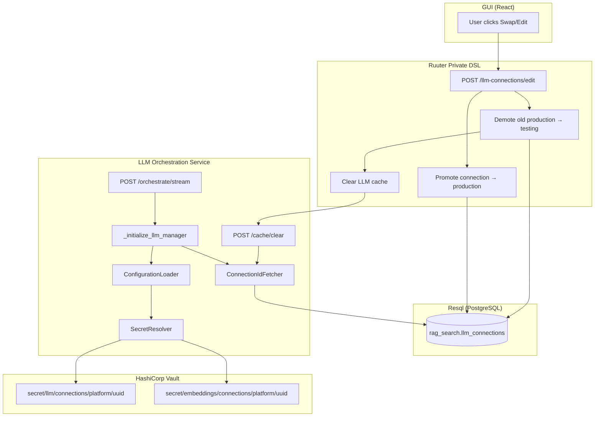
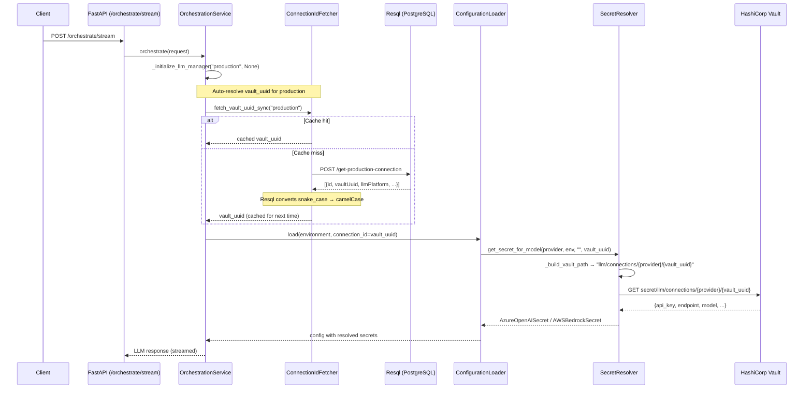
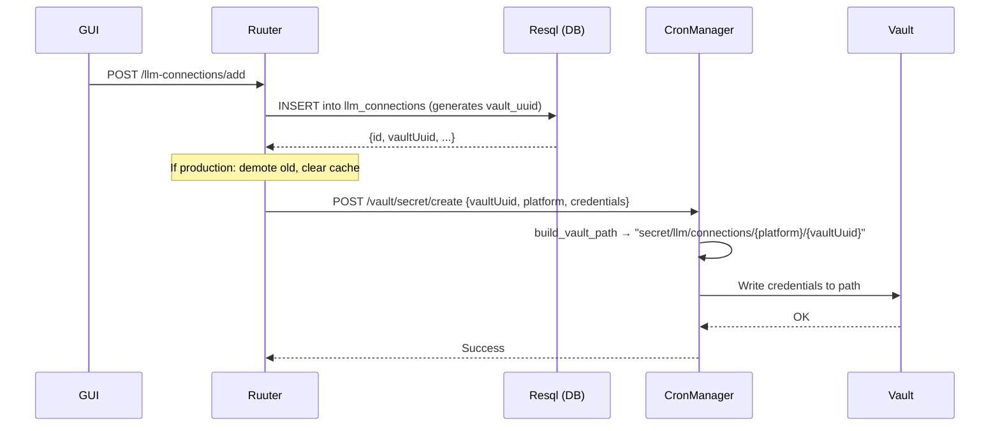

# LLM Connection Swapping Flow

## Overview

LLM connections use a **UUID-based Vault path** design where environment swaps are **pure database operations** with zero Vault I/O. Each connection stores its credentials in Vault once at a fixed path (`secret/llm/connections/{platform}/{vault_uuid}`), and switching which connection is "production" vs "testing" only updates the `environment` column in PostgreSQL.

## Architecture Diagram



## Database Schema

```sql
-- Table: rag_search.llm_connections
CREATE TABLE rag_search.llm_connections (
    id              SERIAL PRIMARY KEY,
    vault_uuid      UUID NOT NULL DEFAULT gen_random_uuid() UNIQUE,
    connection_name TEXT,
    llm_platform    TEXT,       -- e.g., "azure_openai", "aws_bedrock"
    llm_model       TEXT,
    embedding_platform TEXT,
    embedding_model TEXT,
    environment     TEXT,       -- "production" or "testing"
    connection_status TEXT,     -- "active" or "inactive"
    -- ... budget fields, timestamps, etc.
);
```

**Key point:** `vault_uuid` is immutable and assigned at row creation. The `environment` column is the only thing that changes during a swap.

## Vault Path Structure

```
secret/
├── llm/
│   └── connections/
│       ├── azure_openai/
│       │   ├── <vault_uuid_1>    ← credentials for connection 1
│       │   └── <vault_uuid_2>    ← credentials for connection 2
│       └── aws_bedrock/
│           └── <vault_uuid_3>
└── embeddings/
    └── connections/
        ├── azure_openai/
        │   └── <vault_uuid_1>
        └── aws_bedrock/
            └── <vault_uuid_3>
```

Environment is **NOT** part of the Vault path. This is the core design decision — it means swapping environments never touches Vault.

## Connection Swap Flow (Step by Step)

### 1. User Initiates Swap (GUI → Ruuter)

The user edits a "testing" connection and changes its environment to "production" via the GUI. This triggers `POST /llm-connections/edit`.

### 2. Ruuter Orchestrates the Swap (`edit.yml`)

```yaml
# Step 1: Check if promoting testing → production
check_deployment_environment:
  condition: environment == "production" && existing.environment == "testing"
  next: get_existing_production_connection

# Step 2: Find current production connection
get_existing_production_connection:
  call: Resql → get-production-connection
  next: update_existing_production_to_testing

# Step 3: Demote current production to testing (DB only)
update_production_connection:
  call: Resql → update-llm-connection-environment
  body: { connection_id: <old_prod_id>, environment: "testing" }
  next: clear_llm_cache

# Step 4: Invalidate LLM service cache
clear_llm_cache:
  call: POST http://llm-orchestration-service:8100/cache/clear
  next: update_llm_connection

# Step 5: Update the edited connection to production (DB only)
update_llm_connection:
  call: Resql → update-llm-connection
  body: { connection_id: <new_prod_id>, environment: "production", ... }
```

**Total Vault operations: 0** — only PostgreSQL updates and a cache invalidation.

### 3. Cache Invalidation (`POST /cache/clear`)

The LLM orchestration service caches `vault_uuid` and `connection_id` in memory (via `ConnectionIdFetcher`). Without invalidation, it would keep using the old production connection's vault_uuid.

```python
# src/llm_orchestration_service_api.py
@app.post("/cache/clear")
async def clear_connection_cache():
    fetcher = get_connection_id_fetcher()
    fetcher.clear_cache()  # Clears all cached connection_id + vault_uuid entries
    return {"status": "ok"}
```

### 4. Next Request Resolves New Connection

On the next `/orchestrate/stream` request:

```
Request arrives → _initialize_llm_manager(environment="production", connection_id=None)
    ↓
ConnectionIdFetcher.fetch_vault_uuid_sync("production")
    ↓ (cache is empty after clear)
POST Resql → get-production-connection → returns new production row with vaultUuid
    ↓
vault_uuid cached in memory for subsequent requests
    ↓
ConfigurationLoader(environment="production", connection_id=<vault_uuid>)
    ↓
SecretResolver._build_vault_path() → "llm/connections/{provider}/{vault_uuid}"
    ↓
VaultAgentClient.get_secret() → fetches credentials from Vault
    ↓
LLM initialized with new credentials
```

## Connection Resolution Chain



## Where Cache Clear is Triggered

| Operation | File | Triggers `/cache/clear`? |
|-----------|------|--------------------------|
| Add new production connection (demotes existing) | `add.yml` | Yes |
| Edit connection to promote testing → production | `edit.yml` | Yes |
| Delete a connection | `delete.yml` | No (not needed — deleted connections aren't cached) |
| Edit without environment change | `edit.yml` | No (no swap happening) |

## Caching Behavior

### ConnectionIdFetcher Cache (In-Memory)

```python
# Cache keys:
#   "production_connection_id" → int (DB row ID)
#   "production_vault_uuid"    → str (UUID for Vault path)
#   "testing_connection_id"    → int
#   "testing_vault_uuid"       → str

_connection_cache: Dict[str, int | str] = {}
```

- **Populated on:** First request after service start or cache clear
- **Cleared by:** `POST /cache/clear` (called by Ruuter after swap)
- **Thread-safe:** Uses `threading.Lock`

### SecretResolver Cache (TTL-Based)

```python
# Cache key: vault_path string → CachedSecret (data + expires_at)
# TTL: 5 minutes (configurable)
_cache: Dict[str, CachedSecret] = {}
```

- **Populated on:** Successful Vault read
- **Evicted after:** 5-minute TTL
- **Background refresh:** Expired entries are refreshed asynchronously
- **Not cleared by `/cache/clear`** — addressed by TTL expiry

### Why Two Caches?

1. **ConnectionIdFetcher cache** — Avoids repeated DB calls to resolve which connection is currently "production". Cleared instantly on swap.
2. **SecretResolver cache** — Avoids repeated Vault reads for the same credentials. Not cleared on swap because the vault_uuid changes, so the new path is a cache miss anyway.

## Testing vs Production Connection Resolution

| Aspect | Production | Testing |
|--------|-----------|---------|
| `connection_id` in request | Optional (auto-resolved from DB) | Required (must be provided) |
| DB lookup | `get-production-connection` SQL | Not needed (UUID in request) |
| Vault path | `llm/connections/{provider}/{auto_resolved_uuid}` | `llm/connections/{provider}/{provided_uuid}` |
| Caching | Cached in ConnectionIdFetcher | Not cached (provided per-request) |

## Adding a New Connection (Vault Write)

Vault is only written to during **connection creation**, not during swaps:



## Key Design Decisions

1. **No environment in Vault paths** — Swapping is instantaneous (DB UPDATE only), no secret migration needed.
2. **UUID generated by PostgreSQL** — `gen_random_uuid()` DEFAULT ensures it's assigned atomically at INSERT.
3. **Cache invalidation via HTTP** — Ruuter calls `/cache/clear` after any swap to ensure the orchestration service picks up the new production connection on the next request.
4. **Resql auto-converts snake_case to camelCase** — `vault_uuid` in PostgreSQL becomes `vaultUuid` in all JSON responses. All DSL/code must use `vaultUuid`.
5. **Graceful degradation** — If Vault is unavailable, `SecretResolver` falls back to last-known-good cached credentials.

## Troubleshooting

| Symptom | Likely Cause | Fix |
|---------|-------------|-----|
| Old connection still used after swap | Cache not cleared | Verify `clear_llm_cache` step fires in Ruuter DSL; manually call `POST /cache/clear` |
| `vault_uuid` is null in Ruuter | Using `vault_uuid` instead of `vaultUuid` | Resql converts to camelCase — always use `vaultUuid` in DSL |
| "No production connection found" | DB has no row with `environment = 'production'` | Create a production connection via GUI |
| Vault secret not found | Vault path mismatch | Verify CronManager `store_secrets_in_vault.sh` used same `vaultUuid` as DB |
| Stale credentials after 5+ minutes | SecretResolver TTL expired but Vault is down | Check Vault connectivity; fallback cache serves last-known-good |
