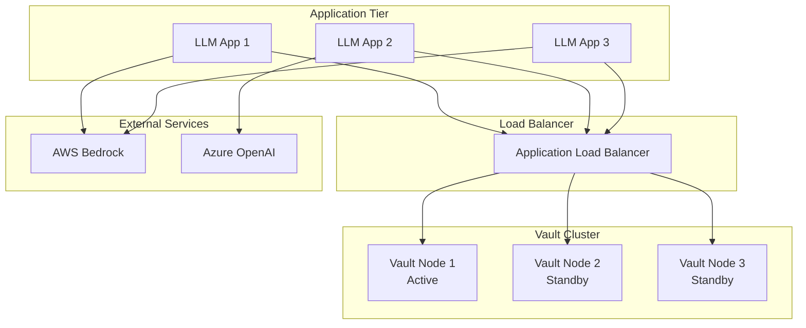

# LLM Config Module - HashiCorp Vault Integration

## Overview

The LLM Config Module integrates with HashiCorp Vault to securely store and manage API keys, endpoints, and other sensitive configuration data for various LLM providers (AWS Bedrock, Azure OpenAI, etc.). This integration replaces the traditional `.env` file approach with a more secure, centralized secret management system.

## Architecture

### Components

1. **VaultSecretResolver** - Core component that interfaces with Vault
2. **ConfigurationLoader** - Loads configuration and resolves secrets from Vault
3. **LLMManager** - Main entry point that initializes with Vault-backed configuration
4. **Connection Management** - Dynamic discovery of provider connections from Vault

### Key Features

- **Environment-Aware**: Automatically discovers and uses appropriate secrets based on environment (production/development/test)
- **User-Independent**: No hardcoded user lists - dynamically discovers available connections
- **Provider Discovery**: Automatically detects which LLM providers are available based on Vault contents
- **Fallback Protection**: Graceful handling when Vault is unavailable (fails securely)

## Vault Data Structure

### Secret Storage Schema

The Vault integration uses the KV v2 secrets engine with the following hierarchical structure:

```
secret/
├── users/
│   ├── user1/
│   │   ├── conn_12345abc/
│   │   │   ├── data/
│   │   │   │   ├── provider: "aws_bedrock"
│   │   │   │   ├── environment: "production"
│   │   │   │   ├── aws_access_key_id: "AKIA..."
│   │   │   │   ├── aws_secret_access_key: "..."
│   │   │   │   ├── aws_region: "us-east-1"
│   │   │   │   └── model_id: "anthropic.claude-3-sonnet-20240229-v1:0"
│   │   └── conn_67890def/
│   │       ├── data/
│   │       │   ├── provider: "azure_openai"
│   │       │   ├── environment: "development"
│   │       │   ├── api_key: "sk-..."
│   │       │   ├── endpoint: "https://myservice.openai.azure.com/"
│   │       │   ├── deployment_name: "gpt-4"
│   │       │   └── api_version: "2024-02-15-preview"
│   └── user2/
│       └── conn_11111xyz/
│           └── data/
│               ├── provider: "aws_bedrock"
│               ├── environment: "production"
│               └── ...
```

### Connection Metadata

Each connection contains:

- **Provider Type**: `aws_bedrock`, `azure_openai`, etc.
- **Environment**: `production`, `development`, `test`
- **Provider-specific secrets**: API keys, endpoints, regions, model IDs
- **Connection ID**: Unique identifier for the connection

## Development Container Setup

### Current Container Configuration

The project includes a development Vault container configured in `docker-compose.yml`:

```yaml
vault:
  image: hashicorp/vault:latest
  container_name: vault
  command: ["vault", "server", "-dev", "-dev-listen-address=0.0.0.0:8200", "-dev-root-token-id=myroot"]
  cap_add:
    - IPC_LOCK
  ports:
    - "8200:8200"
  environment:
    - VAULT_ADDR=http://0.0.0.0:8200
    - VAULT_API_ADDR=http://localhost:8200
    - VAULT_DEV_ROOT_TOKEN_ID=myroot
    - VAULT_DEV_LISTEN_ADDRESS=0.0.0.0:8200
  volumes:
    - vault-data:/vault/data
  networks:
    - bykstack
  restart: unless-stopped
  healthcheck:
    test: ["CMD", "vault", "status"]
    interval: 10s
    timeout: 5s
    retries: 5
```

### Starting the Development Environment

1. **Start Vault Container**:
   ```bash
   docker-compose up vault -d
   ```

2. **Verify Vault is Running**:
   ```bash
   curl http://localhost:8200/v1/sys/health
   ```

3. **Access Vault UI**:
   - URL: http://localhost:8200
   - Token: `myroot`

### Development Configuration

For development, set these environment variables:

```bash
export VAULT_ADDR="http://localhost:8200"
export VAULT_TOKEN="myroot"
```

## Usage Examples

### Production Environment

```python
import os
from llm_config_module import LLMManager

# Set Vault connection details
os.environ["VAULT_ADDR"] = "https://vault.company.com"
os.environ["VAULT_TOKEN"] = "your-production-token"

# Initialize LLM Manager - automatically discovers production providers
manager = LLMManager(environment="production")

# Get available providers (discovered from Vault)
providers = manager.get_available_providers()
print(f"Available providers: {list(providers.keys())}")

# Use the LLM
llm = manager.get_llm()
response = llm.generate("Hello, world!")
```

### Development Environment

```python
# Development requires a specific connection ID
manager = LLMManager(
    environment="development",
    connection_id="conn_12345abc"  # Specific dev connection
)

llm = manager.get_llm()
```

### Dynamic Provider Discovery

The system automatically discovers which providers are available:

```python
manager = LLMManager(environment="production")

# Only providers with valid Vault secrets will be available
if manager.is_provider_available(LLMProvider.AWS_BEDROCK):
    print("AWS Bedrock is configured and available")
    
if manager.is_provider_available(LLMProvider.AZURE_OPENAI):
    print("Azure OpenAI is configured and available")
```

## Configuration Details

### Vault Configuration (llm_config.yaml)

```yaml
vault:
  enabled: true
  url: "${VAULT_ADDR}"
  token: "${VAULT_TOKEN}"
  mount_point: "secret"
  secrets_engine: "kv-v2"

providers:
  aws_bedrock:
    enabled: true  # Will be dynamically determined from Vault
    model_id: "anthropic.claude-3-sonnet-20240229-v1:0"
    max_tokens: 1000
    temperature: 0.7
    
  azure_openai:
    enabled: true  # Will be dynamically determined from Vault
    max_tokens: 1000
    temperature: 0.7
```

### Environment Variable Resolution

The configuration supports environment variable substitution:

- `${VAULT_ADDR}` - Vault server URL
- `${VAULT_TOKEN}` - Vault authentication token

## Production Considerations

### Security Best Practices

#### 1. Authentication & Authorization

**🔒 Token Management**:
```bash
# Use short-lived tokens in production
vault write auth/userpass/users/llm-service password="secure-password" policies="llm-read-policy"

# Generate service token
vault write -field=token auth/userpass/login/llm-service password="secure-password"
```

**🔒 Policy Configuration**:
```hcl
# llm-read-policy.hcl
path "secret/data/users/*/conn_*" {
  capabilities = ["read"]
}

path "secret/metadata/users/*" {
  capabilities = ["list", "read"]
}
```

#### 2. Network Security

**🔒 TLS Configuration**:
```hcl
# vault.hcl (Production)
listener "tcp" {
  address     = "0.0.0.0:8200"
  tls_cert_file = "/etc/ssl/vault/vault.crt"
  tls_key_file  = "/etc/ssl/vault/vault.key"
  tls_min_version = "tls12"
}
```

**🔒 Network Isolation**:
- Deploy Vault in private subnets
- Use VPC endpoints for AWS services
- Implement network ACLs and security groups
- Enable Vault audit logging

#### 3. High Availability Setup

**🏗️ Raft Storage Backend**:
```hcl
storage "raft" {
  path    = "/vault/data"
  node_id = "vault-1"
  
  retry_join {
    leader_api_addr = "https://vault-1.internal:8200"
  }
  retry_join {
    leader_api_addr = "https://vault-2.internal:8200"
  }
  retry_join {
    leader_api_addr = "https://vault-3.internal:8200"
  }
}
```

**🏗️ Auto-Unseal** (recommended):
```hcl
seal "awskms" {
  region     = "us-east-1"
  kms_key_id = "alias/vault-unseal-key"
}
```

#### 4. Monitoring & Logging

**📊 Health Checks**:
```yaml
# kubernetes health check
livenessProbe:
  httpGet:
    path: /v1/sys/health
    port: 8200
    scheme: HTTPS
  initialDelaySeconds: 60
  timeoutSeconds: 5
```

**📊 Audit Logging**:
```hcl
audit "file" {
  file_path = "/vault/logs/audit.log"
}
```

#### 5. Backup & Recovery

**💾 Automated Snapshots**:
```bash
#!/bin/bash
# backup-vault.sh
vault operator raft snapshot save "vault-snapshot-$(date +%Y%m%d-%H%M%S).snap"
aws s3 cp "vault-snapshot-*.snap" s3://vault-backups/
```

### Production Deployment Architecture



### Environment-Specific Configurations

#### Production
```yaml
# Production values
vault:
  url: "https://vault.company.com"
  token: "${VAULT_SERVICE_TOKEN}"  # From secure secret management
  
# Use IAM roles where possible
providers:
  aws_bedrock:
    use_iam_role: true  # Preferred over access keys
```

#### Staging
```yaml
vault:
  url: "https://vault-staging.company.com"
  token: "${VAULT_STAGING_TOKEN}"
```

#### Development
```yaml
vault:
  url: "http://localhost:8200"
  token: "myroot"  # Development only
```

## Migration from .env Files

### Step-by-Step Migration

1. **Identify Current Secrets**:
   ```bash
   # List current .env variables
   grep -E "(API_KEY|SECRET|TOKEN)" .env
   ```

2. **Create Vault Connections**:
   ```bash
   # Example: Migrate AWS credentials
   vault kv put secret/users/production/conn_aws_prod \
     provider="aws_bedrock" \
     environment="production" \
     aws_access_key_id="$AWS_ACCESS_KEY_ID" \
     aws_secret_access_key="$AWS_SECRET_ACCESS_KEY" \
     aws_region="us-east-1" \
     model_id="anthropic.claude-3-sonnet-20240229-v1:0"
   ```

3. **Update Application Code**:
   ```python
   # Before (using .env)
   manager = LLMManager(config_path="config.yaml", environment="production")
   
   # After (using Vault)
   manager = LLMManager(environment="production")  # Auto-discovers from Vault
   ```

4. **Verify Migration**:
   ```python
   # Test that providers are discovered correctly
   providers = manager.get_available_providers()
   assert len(providers) > 0, "No providers discovered from Vault"
   ```

## Testing

### Unit Tests

The integration includes comprehensive test coverage:

- **Vault Integration Tests**: `test_integration_vault_llm_config.py`
- **Provider-Specific Tests**: `test_aws.py`, `test_azure.py`
- **Helper Functions**: `vault_test_helpers.py`

### Running Tests

```bash
# Run all tests
uv run pytest -v

# Run only Vault integration tests
uv run pytest tests/test_integration_vault_llm_config.py -v

# Run provider-specific tests
uv run pytest tests/test_aws.py tests/test_azure.py -v
```

### Test Helpers

The `vault_test_helpers.py` provides utilities for test discovery:

```python
from tests.vault_test_helpers import (
    check_vault_available,
    get_available_providers_from_vault,
    should_skip_aws_test,
    should_skip_azure_test
)

# Conditionally skip tests based on Vault provider availability
@pytest.mark.skipif(should_skip_aws_test(), reason="AWS not available in Vault")
def test_aws_integration():
    # Test will only run if AWS Bedrock is configured in Vault
    pass
```

## Troubleshooting

### Common Issues

#### 1. Vault Connection Failures
```python
# Check Vault connectivity
try:
    from rag_config_manager.vault import VaultClient
    vault = VaultClient()
    print(f"Vault available: {vault.is_vault_available()}")
except Exception as e:
    print(f"Vault error: {e}")
```

#### 2. Provider Discovery Issues
```python
# Debug provider discovery
import os
os.environ["VAULT_ADDR"] = "http://localhost:8200"
os.environ["VAULT_TOKEN"] = "myroot"

manager = LLMManager(environment="production")
providers = manager.get_available_providers()
print(f"Discovered providers: {list(providers.keys())}")
```

#### 3. Authentication Errors
- Verify `VAULT_TOKEN` is valid and not expired
- Check token policies have required permissions
- Ensure Vault server is accessible from application network

#### 4. Secret Path Issues
- Verify secret paths match the expected structure
- Check that secrets exist in the correct mount point
- Ensure proper KV v2 format is used

### Logging

Enable debug logging to troubleshoot issues:

```python
import logging
logging.basicConfig(level=logging.DEBUG)

# The LLM Config Module uses loguru for logging
from loguru import logger
logger.add("vault_debug.log", level="DEBUG")
```

## Best Practices Summary

### ✅ Do:
- Use production-grade Vault deployment with HA
- Implement proper authentication (avoid root tokens)
- Enable TLS in production
- Use auto-unseal mechanisms
- Implement comprehensive monitoring
- Regular backup and recovery testing
- Use IAM roles where possible instead of static keys
- Rotate secrets regularly

### ❌ Don't:
- Use development mode Vault in production
- Store root tokens in application code
- Disable TLS in production environments
- Skip audit logging
- Use overly permissive policies
- Store Vault tokens in environment files
- Forget to implement proper secret rotation

## Support & Maintenance

### Vault Version Compatibility
- **Minimum**: Vault 1.12+
- **Recommended**: Vault 1.15+
- **Tested With**: Vault 1.15.1

### Dependencies
- `rag_config_manager` - Vault client interface
- `hvac` - HashiCorp Vault client library
- `pydantic` - Data validation and settings management

### Monitoring Endpoints
- Health: `GET /v1/sys/health`
- Metrics: `GET /v1/sys/metrics` (Prometheus format)
- Status: `vault status` (CLI command)

This integration provides a robust, secure, and scalable approach to managing LLM provider secrets using HashiCorp Vault, replacing traditional environment variable-based configuration with enterprise-grade secret management.
